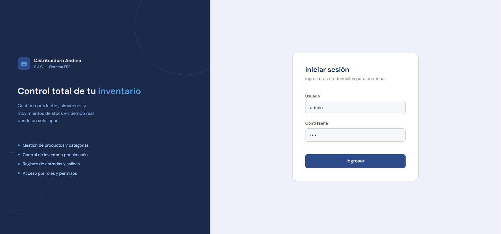
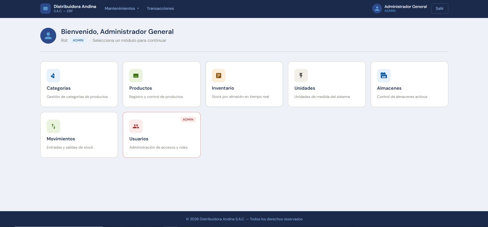
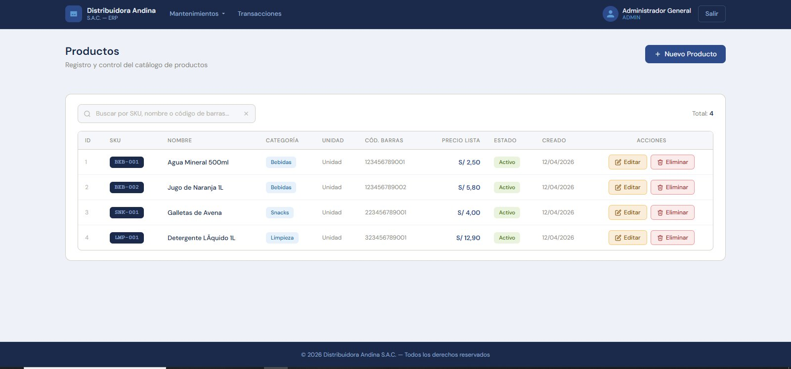
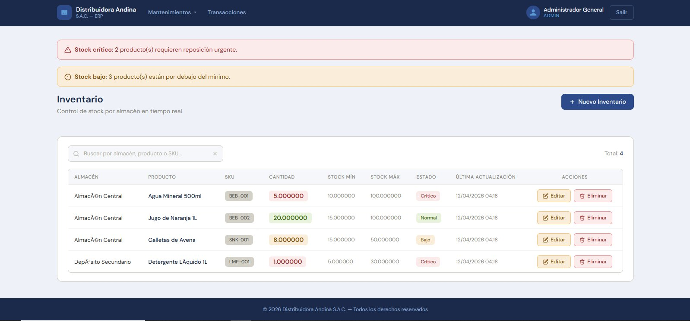
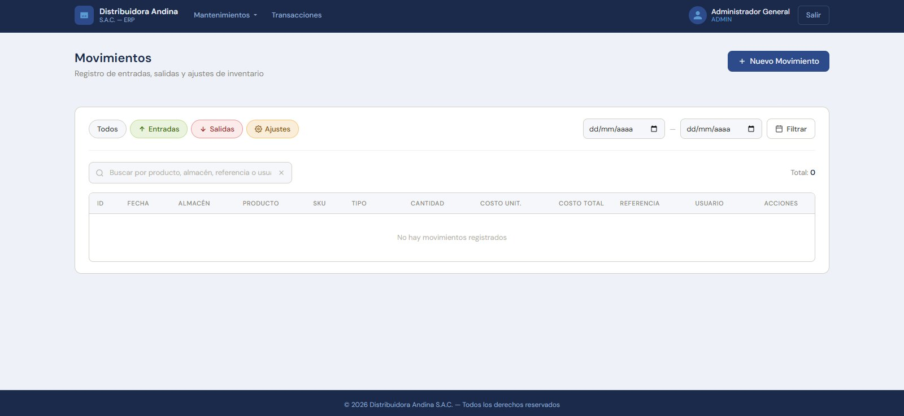
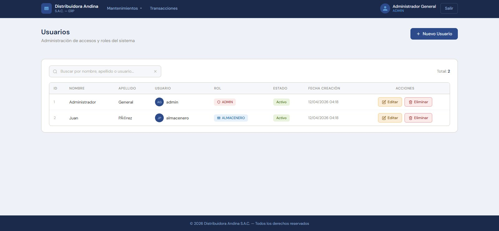

# 📦 ERP de Inventarios — Distribuidora Andina SAC


Sistema web **ERP** para la gestión de inventarios de una empresa distribuidora. Permite controlar productos, almacenes, stock y movimientos en tiempo real, con acceso diferenciado por roles.

> 💡 Proyecto académico con enfoque profesional — arquitectura en capas, API REST y dashboard web.

---

## 🖼️ Vista previa del sistema

| Login | Dashboard |
|---|---|
|  |  |

| Gestión de Productos | Inventario con alertas de stock |
|---|---|
|  |  |

| Movimientos de stock | Gestión de Usuarios |
|---|---|
|  |  |

---

## 📋 ¿Qué problema resuelve?

Las empresas distribuidoras necesitan saber en todo momento cuánto stock tienen, en qué almacén y cómo se mueve. Este sistema centraliza esa información y genera alertas automáticas cuando el stock llega a niveles críticos, evitando quiebres de inventario.

---

## ✅ Funcionalidades

- 📦 CRUD de productos con SKU, categoría, precio y código de barras
- 🏭 Gestión de almacenes (principal, secundario, temporal)
- 📊 Control de stock por almacén con alertas de nivel crítico y bajo
- 🔄 Registro de movimientos: entradas, salidas y ajustes
- 🔐 Autenticación con control de acceso por roles (ADMIN / ALMACENERO)
- 🗂️ Gestión de categorías y unidades de medida
- 🔗 API REST lista para integración con sistemas externos

---

## 🛠️ Stack tecnológico

| Capa | Tecnología |
|---|---|
| Lenguaje | Java 17 |
| Framework | Spring Boot 3 |
| Persistencia | Spring Data JPA / Hibernate |
| Base de datos | MySQL 8 |
| Mapeo DTO | MapStruct |
| Frontend | Thymeleaf + HTML5 + CSS3 |
| Utilidades | Lombok, Jackson |
| Build | Maven |
| Contenedores | Docker + Docker Compose |

---

## 🏗️ Arquitectura en capas

```
src/main/java/pe/com/andinadistribuidora/
├── api/             → Controladores REST y MVC + DTOs
├── entity/          → Entidades JPA (modelo de datos)
├── service/         → Lógica de negocio (interfaces + impl)
├── repository/      → Acceso a datos (Spring Data JPA)
├── mapper/          → Conversión DTO ↔ Entidad (MapStruct)
└── exception/       → Manejo global de errores

src/main/resources/
├── db/              → Script SQL de inicialización
├── templates/       → Vistas Thymeleaf
├── static/          → CSS y JS
└── application.properties
```

---

## 🚀 Ejecución del proyecto

### 🐳 Opción A — Docker (recomendada)

**Requisito único:** tener [Docker Desktop](https://www.docker.com/products/docker-desktop) instalado.

No necesitas Java, Maven ni MySQL instalados en tu PC.

```bash
# 1. Clonar el repositorio
git clone https://github.com/JasonDavD/distribuidora-andina-sac.git
cd distribuidora-andina-sac

# 2. Levantar todo con un solo comando
docker compose up --build
```

Docker se encarga automáticamente de:
- ✅ Compilar el proyecto con Maven
- ✅ Levantar MySQL 8 y crear la base de datos `erp_productos`
- ✅ Ejecutar el script SQL con datos iniciales
- ✅ Iniciar la aplicación Spring Boot

**3. Abrir en el navegador:**
```
http://localhost:8080
```

**Credenciales de acceso:**

| Usuario | Contraseña | Rol |
|---|---|---|
| `admin` | `1234` | Administrador |
| `almacenero` | `abcd` | Almacenero |

**Comandos útiles:**
```bash
docker compose up --build   # Primera vez o tras cambios en el código
docker compose up           # Ejecuciones siguientes (más rápido)
docker compose down         # Detener la aplicación
docker compose down -v      # Detener y resetear la base de datos
docker compose logs -f app  # Ver logs en tiempo real
```

> ⏱️ La primera ejecución puede tardar unos minutos mientras Docker descarga las imágenes base. Las siguientes son considerablemente más rápidas.

---

### 🔧 Opción B — Ejecución local tradicional

**Requisitos:** JDK 17, MySQL Server 8, Maven (o usar el wrapper incluido).

```bash
# 1. Crear la base de datos
mysql -u root -p
CREATE DATABASE erp_productos;

# 2. Ejecutar el script SQL
# Abrir src/main/resources/db/Script.sql en MySQL Workbench y ejecutar

# 3. Configurar credenciales en application.properties
spring.datasource.url=jdbc:mysql://localhost:3306/erp_productos?useSSL=false&serverTimezone=America/Lima
spring.datasource.username=tu_usuario
spring.datasource.password=tu_password

# 4. Ejecutar
./mvnw spring-boot:run        # Linux / macOS
mvnw.cmd spring-boot:run      # Windows
```

---

## 📡 API REST

| Método | Endpoint | Descripción |
|---|---|---|
| GET / POST | `/api/productos` | Listar y crear productos |
| GET / PUT / DELETE | `/api/productos/{id}` | Operaciones por ID |
| GET / POST | `/api/almacenes` | Listar y crear almacenes |
| GET / POST | `/api/inventarios` | Consultar y registrar stock |
| GET / POST | `/api/movimientos` | Entradas, salidas y ajustes |

**Ejemplo de respuesta — GET `/api/productos`:**
```json
[
  {
    "productoId": 1,
    "sku": "BEB-001",
    "nombre": "Agua Mineral 500ml",
    "categoria": "Bebidas",
    "precioLista": 2.50,
    "activo": true
  }
]
```

> 📁 Se incluye la colección **Postman** (`Andina SAC.postman_collection.json`) en la raíz para probar todos los endpoints.

---

## 🎯 Aprendizajes clave

- Desarrollo de aplicaciones empresariales con Spring Boot
- Diseño e implementación de APIs REST
- Arquitectura en capas con separación de responsabilidades
- Mapeo eficiente entre entidades y DTOs con MapStruct
- Manejo de base de datos relacionales con JPA / Hibernate
- Control de acceso basado en roles
- Containerización con Docker y Docker Compose

---

## 📌 Estado del proyecto

- ✔️ Funcional y dockerizado
- 🔒 Mejora pendiente: migrar a Spring Security
- ☁️ Mejora pendiente: despliegue en la nube (Render / Railway)

---

## 👨‍💻 Autor

**Jason Dávila Delgado**  
Full Stack Developer

[](https://github.com/JasonDavD)
[](https://www.linkedin.com/in/jasondavd/)
